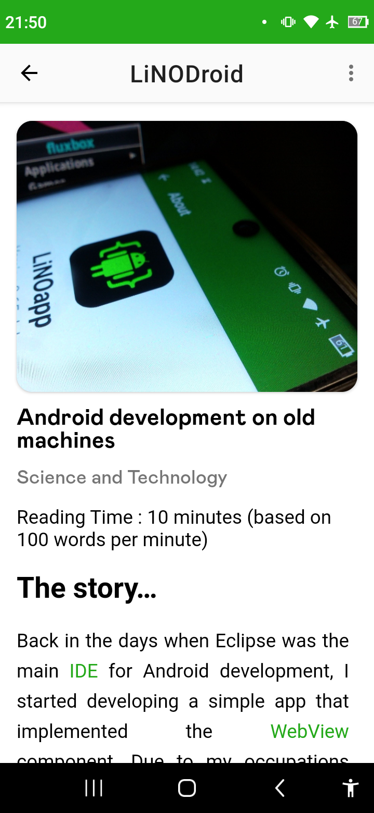
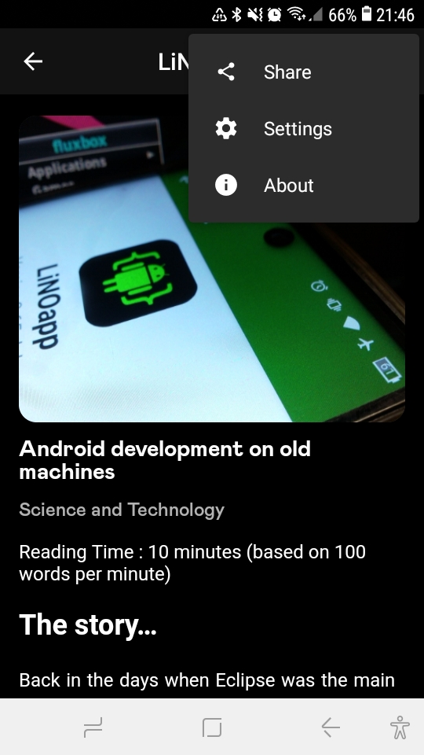
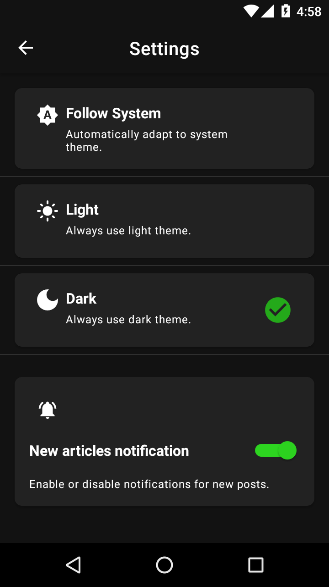
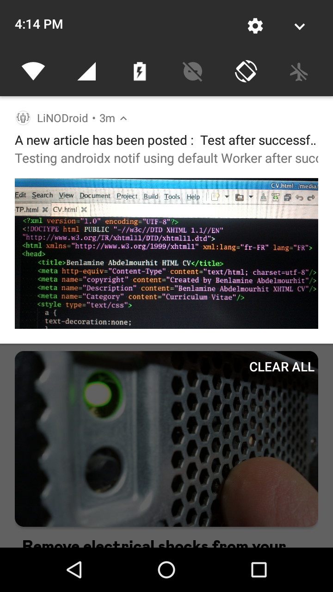

# Introduction 👋

This project "LiNODroid" developed by Benlamine Abdelmourhit (abdelmourhit01@gmail.com) was based on "WordDroid" which provides an example of using WordPress REST API to access content within any WordPress site. 

# Results 🥳

# Features 👩‍💻

- 100% Kotlin-only.
- Following [MVVM architectural design pattern.](https://developer.android.com/jetpack/guide)
- Single activity architecture .
- Using pagination with [jetpack Paging 3 library](https://developer.android.com/topic/libraries/architecture/paging/v3-overview) .
- Using [Navigation Component](https://developer.android.com/guide/navigation/navigation-getting-started) .
- Dependency injection with [Hilt](https://developer.android.com/training/dependency-injection/hilt-android) .
- Kotlin [Coroutines](https://kotlinlang.org/docs/coroutines-overview.html) .
- Kotlin [Flow](https://kotlinlang.org/docs/flow.html) .
- Theme chooser.
- Article sharing.
- Notification for new posts.
- Loadings and network handling.

### Prerequisites

This project assumes a base knowledge of Kotlin and Android, such as Activities, Fragments, RecyclerViews , and the Manifest.

### Adapter :

This package is for recycler adapters of recyclerview because we use paging in this app we need to use pagingdataadapter class   from paging 3 library instead of the normal recyclerview adapter class .

### App :

In this package we have the base Application class we use this class to init hilt .

### Di :

Di package is for Hilt modules .

### Models :

This package is for modles class's for example ( Categories Post ) .

### Network :

In this package we have all the get request's to connect to WordPress REST API and we have also the base URL for the WordPress website change it to match your use case .

### Paging :

 In this Pachage we have PagingSource is used to load pages of data from WordPress  REST API  .

### Repository :

Part of   [MVVM architectural design pattern](https://developer.android.com/jetpack/guide) .

### ViewModel :

Part of   [MVVM architectural design pattern](https://developer.android.com/jetpack/guide) .

## Contributing 🤝

Feel free to open a issue or submit a pull request for any bugs/improvements.
